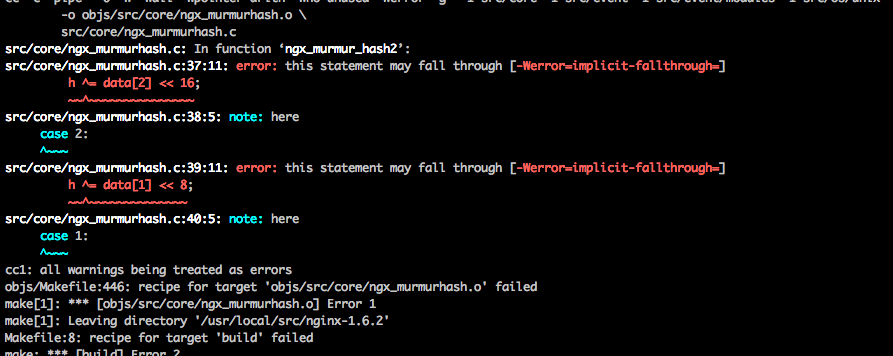
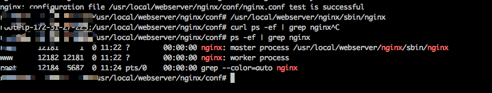

# Install Nginx on AWS EC2

## Launch an AWS EC2 instance

AWS is popular in the USA so I choose to try Nginx on AWS EC2.

Before diving into installing nginx on aws EC2 instance, you need to initiate an aws ec2 instance.

You can find how to at [https://docs.nginx.com/nginx/deployment-guides/amazon-ec2-instances-for-nginx/#automate](https://docs.nginx.com/nginx/deployment-guides/amazon-ec2-instances-for-nginx/#automate).

After creating an AWS EC2 instance, we can login on it by ssh on our desktop terminal.

<h2 style="color:red">Warn</h2>

Be careful with security group setting!

- If you want to acess your AWS EC2 instance from any pc by **ssh via port 22**, you should set accessing source as any.

- At security group, enable server can be visited at port 80 with HTPP protocal.

## Install nginx on AWS EC2

### Install Dependencies(including libs/tools)

- install install make zlib1g zlib1g-dev libtool

```bash
sudo apt-get install make zlib1g zlib1g-dev libtool
```

- install openssl

According to guide [https://serverfault.com/questions/249340/install-openssl-dev-on-ubuntu-server](https://serverfault.com/questions/249340/install-openssl-dev-on-ubuntu-server), *openssl ** is not avialable on ubuntu, so we install *libssl-dev* instead.

```bash
sudo apt-get install libssl1.0-dev
```

- install gcc-c++

```bash
sudo apt-get install g++
sudo apt-get update
sudo apt-get install build-essential
```

Done! We have installed all the dependecies so far.

### Install PCRE

If you need **Rewrite** function for Nginx, you need to install *PCRE*.

- download package

```bash
cd /usr/local/src/
wget http://downloads.sourceforge.net/project/pcre/pcre/8.35/pcre-8.35.tar.gz
```  

- Unzip package

```bash
tar zxvf pcre-8.35.tar.gz
```

- compile and install it

```bash
cd pcre-8.35
./configure
make && make install
```

Now, check the installation result.

```bash
pcre-config --version
```

### Install Nginx

- Download Nginx pacakge and unzip it

```bash
[root@bogon src]# cd /usr/local/src/
[root@bogon src]# wget http://nginx.org/download/nginx-1.6.2.tar.gz
root@bogon src]# tar zxvf nginx-1.6.2.tar.gz
```

- Compile install package and install it

```bash
root@bogon src]# cd nginx-1.6.2
[root@bogon nginx-1.6.2]# ./configure --prefix=/usr/local/webserver/nginx --with-http_stub_status_module --with-http_ssl_module --with-pcre=/usr/local/src/pcre-8.35
```

```bash
[root@bogon nginx-1.6.2]# make
```

At this step, you may meet a problem like following:



The solution is explained in [https://blog.csdn.net/u010889616/article/details/82867091](https://blog.csdn.net/u010889616/article/details/82867091)

```bash
[root@bogon nginx-1.6.2]# make install
```

## config Nginx

- add operating user for Nginx

```bash
[root@bogon conf]# /usr/sbin/groupadd www
[root@bogon conf]# /usr/sbin/useradd -g www www
```

- Replace configure file

```bash
user www www;
worker_processes 1; #设置值和CPU核心数一致
error_log /usr/local/webserver/nginx/logs/nginx_error.log crit; #日志位置和日志级别
pid /usr/local/webserver/nginx/nginx.pid;
#Specifies the value for maximum file descriptors that can be opened by this process.
worker_rlimit_nofile 65535;
events
{
  use epoll;
  worker_connections 65535;
}
http
{
  include mime.types;
  default_type application/octet-stream;
  log_format main  '$remote_addr - $remote_user [$time_local] "$request" '
               '$status $body_bytes_sent "$http_referer" '
               '"$http_user_agent" $http_x_forwarded_for';
  
#charset gb2312;
  server_names_hash_bucket_size 128;
  client_header_buffer_size 32k;
  large_client_header_buffers 4 32k;
  client_max_body_size 8m;
  sendfile on;
  tcp_nopush on;
  keepalive_timeout 60;
  tcp_nodelay on;
  fastcgi_connect_timeout 300;
  fastcgi_send_timeout 300;
  fastcgi_read_timeout 300;
  fastcgi_buffer_size 64k;
  fastcgi_buffers 4 64k;
  fastcgi_busy_buffers_size 128k;
  fastcgi_temp_file_write_size 128k;
  gzip on;
  gzip_min_length 1k;
  gzip_buffers 4 16k;
  gzip_http_version 1.0;
  gzip_comp_level 2;
  gzip_types text/plain application/x-javascript text/css application/xml;
  gzip_vary on;
  #limit_zone crawler $binary_remote_addr 10m;
 #下面是server虚拟主机的配置
 server
  {
    listen 80;#监听端口
    server_name localhost;#域名
    index index.html index.htm index.php;
    root /usr/local/webserver/nginx/html;#站点目录
      location ~ .*\.(php|php5)?$
    {
      #fastcgi_pass unix:/tmp/php-cgi.sock;
      fastcgi_pass 127.0.0.1:9000;
      fastcgi_index index.php;
      include fastcgi.conf;
    }
    location ~ .*\.(gif|jpg|jpeg|png|bmp|swf|ico)$
    {
      expires 30d;
  # access_log off;
    }
    location ~ .*\.(js|css)?$
    {
      expires 15d;
   # access_log off;
    }
    access_log off;
  }

}
```

and check the this config file

```bash
/usr/local/webserver/nginx/sbin/nginx -t
```

- Start Nginx server and check Nginx server status

```bash
[root@bogon conf]# /usr/local/webserver/nginx/sbin/nginx
[root@bogon conf]# ps -ef | grep nginx
```

Congradulations, we installed Nginx on EC2 successfully.


