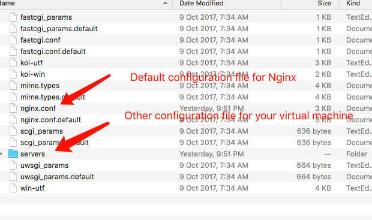

# config Nginx  on mac

## Install Nginx on your mac

- How to install Nginx on MacOS

```bash
root # brew search nginx
root # brew install nginx
```

- Path of Nginx

```bash
root# /usr/local/etc/nginx/nginx.conf
root#/usr/local/var/www
root# /usr/local/Cellar/nginx/1.6.2
```

Nginx is started by default after installed. You can use

```bash
root# ps -ef | grep nginx
```

to check Nginx process status.

## config Nginx on MacOS

The default configure file of Nginx  is 

```bash
root# /usr/local/etc/nginx/nginx.conf
```

Now we go to

```bash
root # /usr/local/etc/nginx
```

to have a look.



### Explaination of nginc.conf

- How to locate nginx configure files

```bash
root# nginx -t
```

also; this command can be  used to check the correctness of a Nginx config file.

For my MacBook, the configure files are

```bash
 /usr/local/etc/nginx/servers/book.conf
 /usr/local/etc/nginx/nginx.conf
```

- How to config nginx file for express in local development

Let's dive into **/usr/local/etc/nginx/nginx.conf**

```conf

#user  nobody;
worker_processes  1;

#error_log  logs/error.log;
#error_log  logs/error.log  notice;
#error_log  logs/error.log  info;

#pid        logs/nginx.pid;


events {
    worker_connections  1024;
}


http {
    include       mime.types;
    default_type  application/octet-stream;

    #log_format  main  '$remote_addr - $remote_user [$time_local] "$request" '
    #                  '$status $body_bytes_sent "$http_referer" '
    #                  '"$http_user_agent" "$http_x_forwarded_for"';

    #access_log  logs/access.log  main;

    sendfile        on;
    #tcp_nopush     on;

    #keepalive_timeout  0;
    keepalive_timeout  65;

    gzip  on;

    server {
        listen       80;
        server_name  localhost;

        #charset koi8-r;

        #access_log  logs/host.access.log  main;

        location / {
            root   html;
            index  index.html index.htm;
        }

        #error_page  404              /404.html;

        # redirect server error pages to the static page /50x.html
        #
        error_page   500 502 503 504  /50x.html;
        location = /50x.html {
            root   html;
        }

        #some other code are Omitted.
    }


    # another virtual host using mix of IP-, name-, and port-based configuration
    #
    #server {
    #    listen       8000;
    #    listen       somename:8080;
    #    server_name  somename  alias  another.alias;

    #    location / {
    #        root   html;
    #        index  index.html index.htm;
    #    }
    #}


    # https sever setting is omitted.
    # include virtual host configuration files here
    include servers/*;
}
```

So as you can see, at the last line of *nginx.conf*, there is a segment

```bash
include servers/*
```

which means including other configuration file suffix conf for Nginx. Here is one of my configure file.

```conf
server {
  # port
  listen       80;

  #domain name
  server_name  bookadmin.com www.bookadmin.com;
  
  location / {
    # act as an agent for
    proxy_pass http://127.0.0.1:3000;
    # root for domain
    root /pathname/projectname/server/public;
  }

  # Let Nginx hanle static file directly
  location ~.*\.(html|htm|gif|jpg|jpeg|bmp|png|ico|txt|js|css)$ {
    root /pathname/projectname/server/public;
  }
}
```

After adding a new conf file for nginx, you need to reload nginx to check  your result.

```bash
nginx -s reload
```
